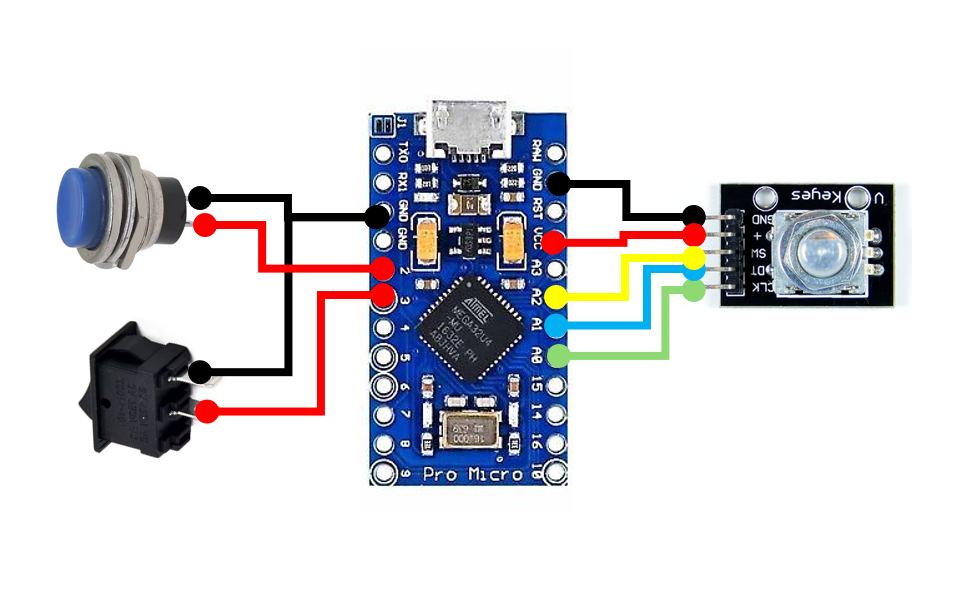

# Custom Keys

A customizable input device based on Arduino featuring a **rotary encoder** and **two push buttons**. Designed for quick system control such as volume adjustment, media shortcuts, system locking, and more - using USB HID functionality.

## :rocket: Features

- Volume control with the encoder (up/down/mute)
- Mouse movement triggered by a button
- System lock shortcut (`Win + L`)
- Single and double click detection on the encoder button
- Debouncing logic to prevent accidental input
- Auto-unlock logic after user interaction or timeout

## :hammer_and_wrench: Recommended Hardware

- Arduino **Pro Micro** or **Leonardo** (HID-compatible)
- Rotary encoder with push button (EC11 or similar)
- 1 push button
- 1 switch button
- Jumper wires and breadboard or custom PCB

## :link: Wiring

| Component      | Arduino Pin   |
|----------------|----------------|
| Encoder CLK    | A0             |
| Encoder DT     | A1             |
| Encoder SW     | A2             |
| Push Button    | 2              |
| Switch Button  | 3              |

> :warning: All buttons use `INPUT_PULLUP`, so they should connect to **GND** when pressed.

## :package: Required Libraries

Install these libraries via the Arduino IDE Library Manager or manually:

- [`ClickEncoder`](https://github.com/0xPIT/encoder)
- [`TimerOne`](https://github.com/PaulStoffregen/TimerOne)
- [`HID-Project`](https://github.com/NicoHood/HID)

## :gear: Setup & Upload

1. Connect your Pro Micro / Leonardo to your computer.
2. Open `custom-keys.ino` in the Arduino IDE.
3. Select the correct board and COM port.
4. Install required libraries if needed.
5. Upload the sketch.
6. Done! Start using your custom buttons and encoder.

## :page_with_curl: License

This project is licensed under the **GNU General Public License (GPL)**. See the `LICENSE` file for details.

## :astronaut: Credits

Created by Ferran Catalan.  
Inspired by the need for quick, customizable system control with simple hardware.
